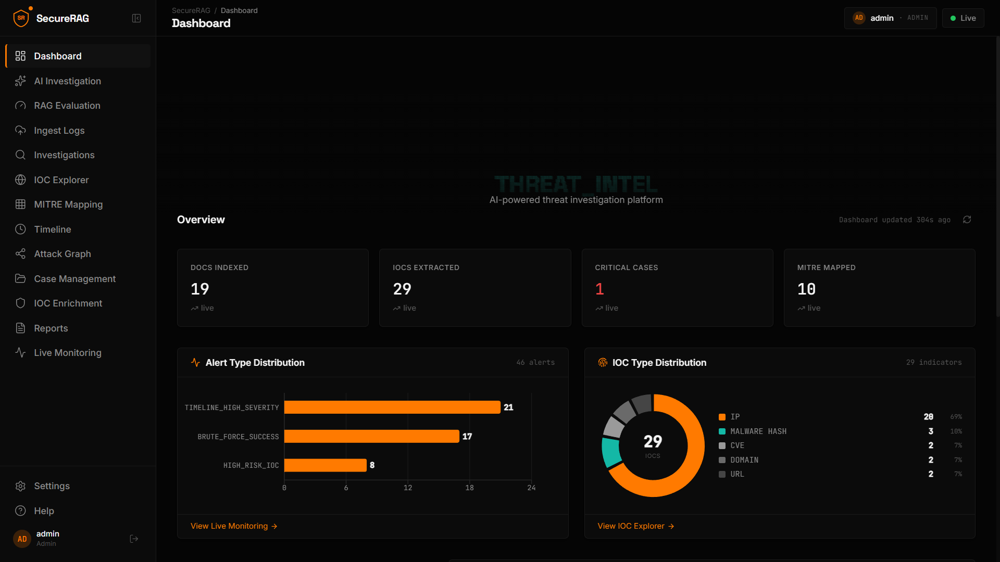
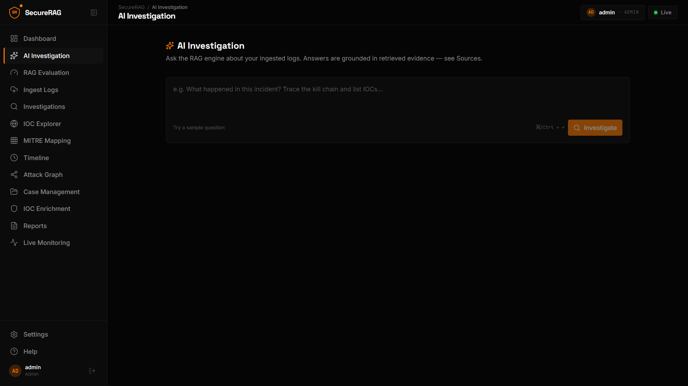
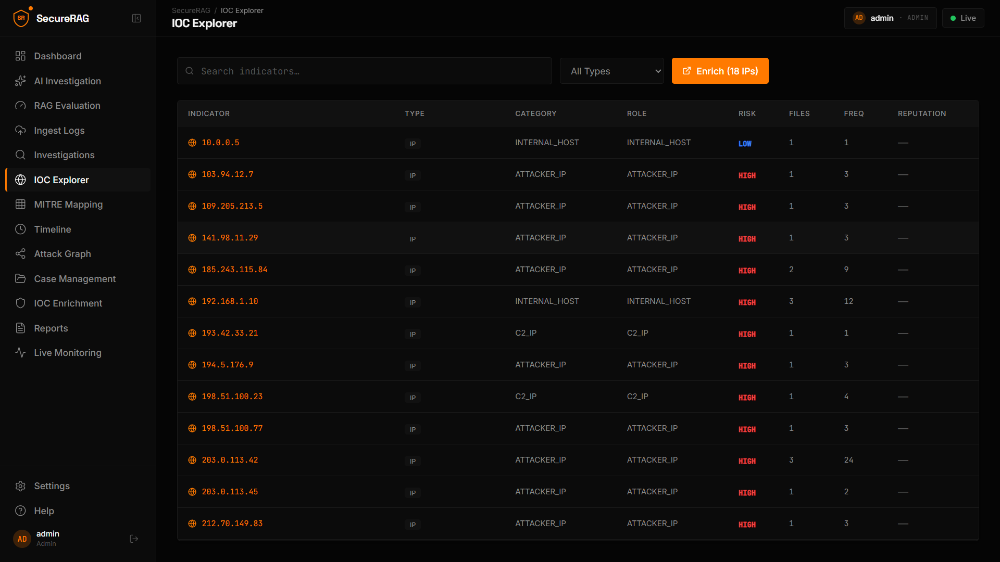
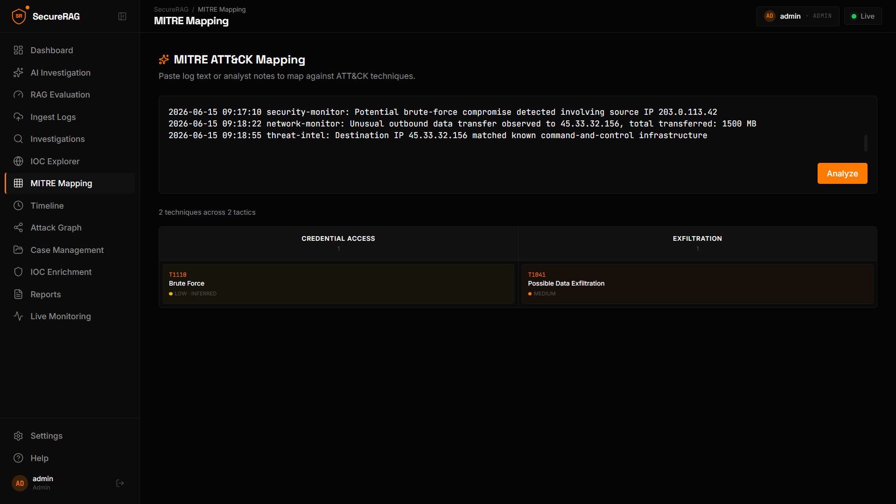
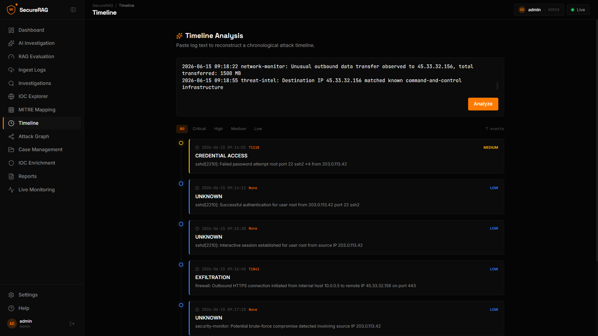
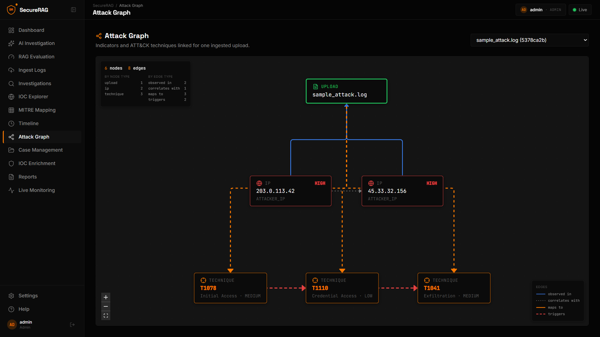
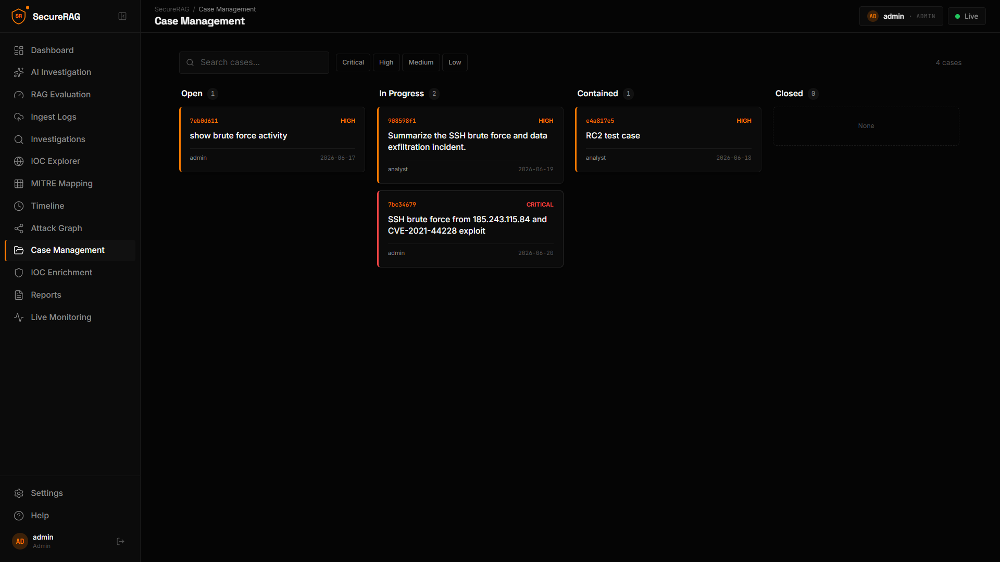
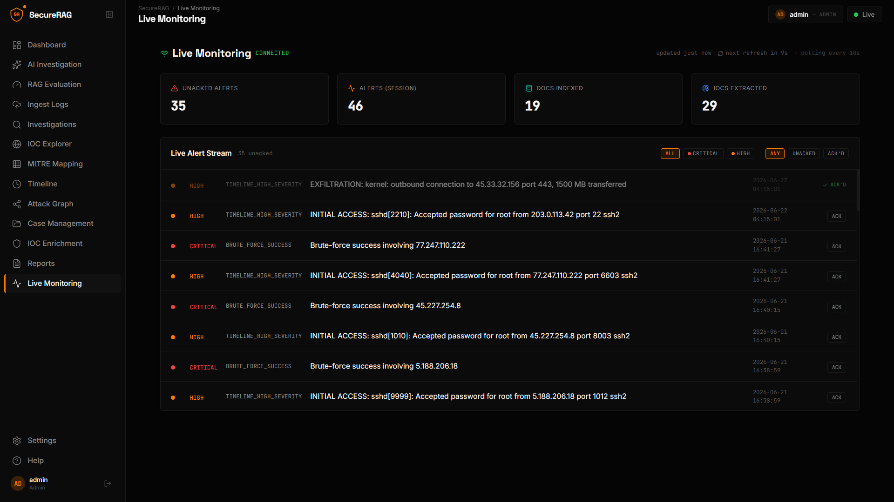
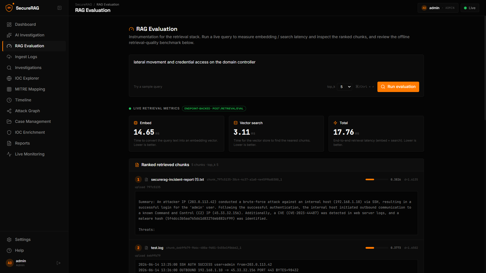

# SecureRAG
[](https://github.com/Hemanth19i/SecureRAG/actions/workflows/ci.yml)

## 🎥 Watch SecureRAG in Action

[Watch Demo Video](https://youtu.be/RVEu-tW_dhg?si=Ztjuzv8Vyn11BSsC)

**AI-powered threat-intelligence & SIEM platform.** Ingest security logs, retrieve
relevant evidence with RAG, and automatically extract IOCs, correlate them, map to
MITRE ATT&CK, build attack timelines and graphs, manage cases with an audit trail,
enrich indicators with threat intel, measure retrieval quality, and surface
real-time alerts.

> Status: **v1.0** — feature complete. Flask + React (TypeScript), JWT-secured,
> CI on every PR, Docker-deployable.

---

## 1. Overview

SecureRAG turns raw, unstructured security logs into structured, analyst-ready
intelligence. A Flask backend runs the ingestion/analysis pipeline over SQLite +
ChromaDB and exposes a JWT-secured REST API; a React 19 + TypeScript (Vite)
single-page app provides the SOC console — dashboard analytics, AI investigation,
IOC explorer & enrichment, MITRE view, timeline, attack graph, case management
with an audit trail, a RAG-evaluation page, and a live alert stream.

LLM analysis is provided by **Google Gemini** with an automatic **rule-based
fallback**, so the product degrades gracefully when no API key is configured.

---

## 2. Key Features

Every feature below is backed by a real page, endpoint, and subsystem (see
[§8 API Overview](#8-api-overview) and
[docs/ARCHITECTURE_DIAGRAMS.md](docs/ARCHITECTURE_DIAGRAMS.md)).

**Investigation & analysis**
- **AI Investigation** — ask a natural-language question; get an evidence-grounded
  answer (severity, threats, recommendations) plus the IOCs, correlation, MITRE,
  and timeline used to answer (`POST /query`, Gemini + rule-based fallback).
- **Log Ingestion** — chunk → embed → ChromaDB + SQLite persistence (`POST /upload`).
- **Duplicate Upload Prevention** — SHA-256 file-hash dedup (`409` on re-upload).
- **IOC Extraction** — IPs, hashes, CVEs, domains, emails, URLs, IPv6.
- **IOC Explorer** — cross-log correlation with risk scoring and analyst insights
  (`POST /correlate`).
- **IOC Enrichment** — AbuseIPDB IP reputation, cache-first with TTL (`GET /enrich`).
- **MITRE ATT&CK Mapping** — technique/tactic mapping + kill-chain assembly.
- **Timeline Analysis** — chronological threat events with severity.
- **Attack Graph** — node/edge relationship graph for one upload (`GET /attack-graph`).

**Operations**
- **Case Management** — create/list/update cases, lifecycle status, threaded notes.
- **Audit Trail** — append-only case history (created / status / assignment / note /
  evidence-linked), returned with the case detail.
- **Live Monitoring** — alert generation, acknowledge lifecycle, cursor-based delta
  polling, severity/acked filters, and live ingestion (`POST /monitor/feed`).
- **Reports** — incident report generation (`POST /report`).

**Measurement & analytics**
- **RAG Evaluation** — a dedicated retrieval-only path (`POST /retrieval/eval`)
  surfacing per-stage latency (embed / search / total) and ranked chunks with
  similarity/distance, alongside the offline Recall@K / MRR benchmark.
- **Dashboard Analytics** — KPI readouts plus real-data distribution charts (IOC
  type, alert type) from `GET /stats`, `GET /alerts`, and `POST /correlate`.

**Platform**
- **Authentication & RBAC** — JWT access/refresh tokens, ADMIN / ANALYST roles,
  login rate limiting, fail-closed secret validation.

---

## 3. Architecture

```
              React 19 + TS SPA (Vite, App.tsx)  ── dev: :3000
   dashboard | AI investigation | ingest | investigations | IOC explorer
   IOC enrichment | MITRE | timeline | attack graph | cases | reports
            live monitoring | RAG evaluation | settings
                              |
                     /api proxy (dev) · HTTPS + JWT (Bearer)
                              v
                      Flask API (api/)  ── :5000
          auth_bp (/auth) | api_bp | JWT | CORS | rate limit
                              |
        +---------------------+----------------------+
        v                     v                      v
  intelligence/            rag/                external APIs
  ingest pipeline     chunker | embedder       Gemini (LLM)
  IOC | MITRE |       (all-MiniLM-L6-v2)       AbuseIPDB (TI)
  timeline |          vectorstore (ChromaDB)
  correlator |
  alerts | cases
        |
        v
  SQLite (WAL) SIEM store
  log_chunks | extracted_iocs | mappings | mitre |
  timeline | cases | notes | audit | enrichment | alerts
```

**Ingestion pipeline** (shared by `/upload` and `/monitor/feed` via `ingest_text`):

```
text -> chunk -> embed -> ChromaDB -> SQLite{IOCs, MITRE, timeline} -> correlate -> alerts
```

Full Mermaid diagram set (system context, components, data flow, data model,
deployment, alert/auth state machines): **[docs/ARCHITECTURE_DIAGRAMS.md](docs/ARCHITECTURE_DIAGRAMS.md)**.

---

## 4. Tech Stack

- **Backend:** Python 3.11, Flask (blueprints), Flask-JWT-Extended, SQLite (WAL),
  ChromaDB, SentenceTransformers (`all-MiniLM-L6-v2`), Google Gemini.
- **Frontend:** React 19, TypeScript, Vite, Tailwind CSS + shadcn/ui,
  React Router, React Flow (`@xyflow/react`, attack graph), Recharts (dashboard
  charts), three.js (hero canvas).
- **Infra:** Waitress/gunicorn WSGI, Docker + Docker Compose, nginx (static SPA);
  CI via GitHub Actions (ruff + pytest).

---

## 5. Screenshots

Capture per the checklist in [docs/screenshots/README.md](docs/screenshots/README.md)
and commit the PNGs to `docs/screenshots/`.

| View | Screenshot |
|---|---|
| Dashboard |  |
| AI Investigation |  |
| IOC Explorer |  |
| MITRE Mapping |  |
| Timeline |  |
| Attack Graph |  |
| Case Management |  |
| Live Monitoring |  |
| RAG Evaluation |  |

---

## 6. Installation

### Prerequisites
- Python **3.10+** (developed on 3.11)
- Node **18+** (developed on 20)

### Backend
```bash
cd server
python -m venv venv
# Windows: venv\Scripts\activate   |   macOS/Linux: source venv/bin/activate
pip install -r requirements.txt

cp .env.example .env
# Edit .env: set a STRONG JWT_SECRET_KEY (>=32 chars) and (optionally) GEMINI_API_KEY.
#   python -c "import secrets; print(secrets.token_urlsafe(48))"

python app.py            # serves http://localhost:5000
```
On first start an `admin` user is created. If `DEFAULT_ADMIN_PASSWORD` is unset (or
weak), a strong random password is generated and **printed once** in the logs —
save it.

### Frontend
```bash
cd frontend
npm install
npm run dev              # serves http://localhost:3000
```
The Vite dev server proxies `/api` → `http://localhost:5000`, so the SPA talks to
the backend same-origin — no `VITE_API_BASE_URL` and no CORS config are needed in
development. (`frontend/.env.local` is empty by default.)

---

## 7. Local Development

- **Run order:** start the backend (`:5000`) first, then the frontend (`:3000`).
- **API base:** in dev the app uses the same-origin `/api` proxy
  (`vite.config.ts`); set `VITE_API_BASE_URL` only for production builds that talk
  to a remote API origin (see [DEPLOYMENT.md](DEPLOYMENT.md)).
- **Build / typecheck:** `npm run build` (runs `tsc -b` then `vite build`).

### Environment Variables

Backend (`server/.env`):

| Variable | Required | Default | Description |
|---|---|---|---|
| `JWT_SECRET_KEY` | **Yes** | — | JWT signing key; must be ≥32 chars and not a known placeholder (app refuses to start otherwise). |
| `GEMINI_API_KEY` | No | — | Google Gemini key. If unset, the rule-based analyzer is used. |
| `ABUSEIPDB_API_KEY` | No | — | Enables IP reputation enrichment; degrades gracefully if unset. |
| `DEFAULT_ADMIN_PASSWORD` | No | (random) | Bootstrap admin password. Weak values are ignored and replaced by a random one. |
| `CHROMA_DB_PATH` | No | `./chroma_store` | ChromaDB persistence directory. |
| `FLASK_PORT` | No | `5000` | Backend port. |
| `FLASK_DEBUG` | No | `false` | Enable Werkzeug debug (never in production). |
| `LOG_LEVEL` | No | `INFO` | Logging level. |
| `MAX_UPLOAD_MB` | No | `50` | Max request body size (MB). |
| `CORS_ORIGINS` | No | `http://localhost:5173` | Comma-separated allowed frontend origins (used for direct/prod access; the dev proxy is same-origin). |
| `SQLITE_TIMEOUT_SECONDS` | No | `30` | SQLite busy/lock wait. |
| `MAX_QUERY_CHARS` | No | `10000` | Max `/query` length. |
| `MAX_TOP_K` | No | `50` | Max retrieval `top_k`. |
| `MAX_FEED_CHARS` | No | `1000000` | Max `/monitor/feed` content length. |
| `MAX_SOURCE_CHARS` | No | `200` | Max `/monitor/feed` source length. |
| `ENRICH_TTL_SECONDS` | No | `86400` | Threat-intel cache TTL (success). |
| `ENRICH_NEG_TTL_SECONDS` | No | `3600` | Threat-intel negative cache TTL. |
| `LOGIN_RATE_LIMIT` | No | `10` | Max login attempts per window. |
| `LOGIN_RATE_WINDOW` | No | `60` | Login rate-limit window (seconds). |

Frontend (`frontend/.env.local`, production builds only):

| Variable | Default | Description |
|---|---|---|
| `VITE_API_BASE_URL` | (empty → `/api` proxy) | Backend base URL for production builds, e.g. `https://api.your-domain.com`. |

---

## 8. API Overview

All endpoints require `Authorization: Bearer <access_token>` except
`POST /auth/login`. Roles: **A** = ADMIN, **N** = ANALYST.

### Auth
| Method | Path | Role | Body → Response |
|---|---|---|---|
| POST | `/auth/login` | public | `{username, password}` → `{access_token, refresh_token, role}` |
| POST | `/auth/refresh` | refresh token | → `{access_token}` |
| POST | `/auth/register` | A | `{username, password, role}` → `201` |

### Core
| Method | Path | Role | Notes |
|---|---|---|---|
| POST | `/upload` | A | multipart `file` → `{message, chunks_stored}`; `409` on duplicate |
| POST | `/query` | A·N | `{query, top_k?}` → analysis + iocs + correlation + mitre + timeline + citations |
| POST | `/retrieval/eval` | A·N | `{query, top_k?}` → ranked chunks + per-stage latency (retrieval only) |
| GET | `/stats` | A·N | → `{readouts, evidence}` |
| POST | `/report` | A·N | `{analysis}` → `{report}` |
| GET | `/debug/chunks` | A | debug: list stored chunks |

### Intelligence
| Method | Path | Role | Notes |
|---|---|---|---|
| POST | `/correlate` | A·N | → correlation summary + analyst insights |
| POST | `/mitre-map` | A·N | `{text}` → MITRE techniques + kill chain |
| POST | `/timeline` | A·N | `{text}` → timeline events |
| GET | `/attack-graph?upload_id=` | A·N | → `{nodes, edges}`; `404` if unknown upload |
| GET | `/enrich?value=` | A·N | → threat-intel record (cache-first) |

### Cases
| Method | Path | Role |
|---|---|---|
| POST | `/cases` | A·N |
| GET | `/cases` | A·N |
| GET | `/cases/<id>` | A·N (returns fields + notes + audit trail) |
| PATCH | `/cases/<id>` | A·N |
| POST | `/cases/<id>/notes` | A·N |
| GET | `/cases/<id>/notes` | A·N |
| POST | `/cases/<id>/link-evidence` | A·N |

### Alerts & Monitoring
| Method | Path | Role | Notes |
|---|---|---|---|
| GET | `/alerts?since=&limit=` | A·N | cursor poll → `{alerts, total, cursor}` |
| PATCH | `/alerts/<id>` | A·N | `{acknowledged: true}` |
| POST | `/monitor/feed` | A | `{source, content}` → `{upload_id, chunks_stored, alerts_created}` |

The `POST /query` response shape is locked by a contract test — see
[server/tests/CONTRACT.md](server/tests/CONTRACT.md).

---

## 9. Demo Walkthrough (5-minute)

Sample attack logs and a full ~10-minute script live in
[`demo/`](demo/) ([demo/DEMO_SCRIPT.md](demo/DEMO_SCRIPT.md)). Condensed flow:

1. **Login** as `admin` (password from first-start logs or `DEFAULT_ADMIN_PASSWORD`).
2. **Ingest Logs** — upload a sample from `demo/sample_logs/`; the pipeline runs
   automatically (re-upload returns `409`).
3. **AI Investigation** — ask *"was there a brute-force attack and did it succeed?"*;
   review the AI analysis, IOCs, correlation, MITRE, and timeline.
4. **IOC Explorer** — inspect correlated indicators; **enrich** a public IP.
5. **MITRE / Timeline / Attack Graph** — explore techniques, sequence, relationships.
6. **Case Management** — save the investigation as a case; set status, add a note,
   review the audit trail.
7. **Live Monitoring** — acknowledge alerts; filter by severity; watch the countdown.
8. **RAG Evaluation** — run a query to measure embed/search latency and inspect the
   ranked chunks; review the offline Recall@K / MRR benchmark.

---

## 10. Known Limitations

Honest constraints of the current build:

- **Desktop-first UI** — fixed max-width layout with a sidebar; not mobile-optimized.
- **Demo-scale data** — distributions are real but small (single-node, single-tenant).
- **ADMIN-provisioned users** — no self-service registration (`/auth/register` is
  ADMIN-only) and **no password-reset** workflow.
- **Recall@K / MRR are offline-only** — measured by `server/eval/recall_eval.py`
  against a labeled set. The live `/retrieval/eval` returns latency + ranked chunks;
  its `recall_at_k` field is a forward hook and is always `null`.
- **Limited historical analytics** — no time-series/trend charts (ingest data is
  bursty at demo scale, which would render misleadingly sparse).
- **No per-upload MITRE/timeline read endpoint** — `/mitre-map` and `/timeline`
  analyze submitted text; stored per-upload analysis isn't separately readable.
- **No upload management** — uploads can't be listed/deleted individually via the API.
- **Single-node SQLite** (WAL + busy-timeout), **polling** real-time delivery (~10s),
  **in-memory rate limiter** (per process), and a JS bundle >500 kB (no
  code-splitting). The `VIEWER` role is reserved but not yet wired to endpoints.

---

## 11. Roadmap

Deferred items from prior audits (realistic future work):

- Upload management (view/delete uploads).
- A Dashboard "RAG Health" summary card (latency-based).
- Ground-truth **live Recall@K** scoring (response hook already present).
- Per-upload MITRE/timeline read endpoints.
- Richer report exports (beyond plain text).
- Push delivery via SSE/WebSocket (the cursor maps cleanly to `Last-Event-ID`).
- Wire the read-only `VIEWER` role; Redis-backed rate limiting; optional Postgres
  backend; route-level code-splitting.

---

## Testing

Backend tests live in `server/tests/` (pytest). They run **offline** — the
embedding model and Gemini are stubbed/mocked, and tests use temporary SQLite +
Chroma stores, so your real `securerag.db` / `chroma_store` are never touched.

```bash
cd server
pip install -r requirements-dev.txt

pytest                 # unit + contract + API tests (integration excluded by default)
ruff check .           # lint
pytest -m integration  # opt-in end-to-end: REAL embedder + Chroma + /query
```

From the repo root: `make test`, `make lint`, `make test-integration`.

- The **contract test** (`tests/test_contract_query.py`) locks the `/query`
  response shape — documented in [server/tests/CONTRACT.md](server/tests/CONTRACT.md).
- **CI** (`.github/workflows/ci.yml`) runs ruff + pytest (excluding integration)
  on every push and PR (Python 3.11), with pip caching.

### Retrieval Evaluation (offline RAG metrics)

Retrieval is measured with a labeled harness ([`server/eval/`](server/eval/)): a
**30-entry SOC-log corpus** with **10 query→target pairs**. Relevance is exact — a
query is a hit at rank *r* iff the retrieved chunk id at *r* is the labeled target.
Metrics are computed over the **real** stack (SentenceTransformer `all-MiniLM-L6-v2`
+ ChromaDB).

```bash
cd server
python eval/recall_eval.py                 # semantic baseline
python eval/recall_eval.py --mode hybrid   # semantic + BM25 fused via RRF
python eval/recall_eval.py --mode rerank   # hybrid + cross-encoder rerank
```

**Results (corpus = 30, queries = 10):**

| Metric | Semantic | Hybrid (BM25+RRF) | Hybrid + Rerank |
|---|---|---|---|
| Recall@1 | 0.80 | 0.80 | **0.90** |
| Recall@3 | 1.00 | 1.00 | 1.00 |
| Recall@5 | 1.00 | 1.00 | 1.00 |
| MRR | 0.90 | 0.90 | **0.95** |

*Honest read:* BM25+RRF fusion alone changed nothing on this set; the cross-encoder
reranker is what lifted Recall@1 0.80→0.90 and MRR 0.90→0.95. Recall@3/@5 are
saturated at this corpus size, so Recall@1 and MRR are the meaningful signals.
These offline numbers are surfaced (clearly labeled as a benchmark, not live) on
the RAG Evaluation page.

---

## Security Notes

- Secrets live only in `server/.env` (gitignored). Never commit real keys.
- The app fails closed without a strong `JWT_SECRET_KEY`.
- Default runtime is the Flask/Werkzeug dev server; for production, front it with a
  WSGI server (waitress/gunicorn) behind TLS. See [SECURITY.md](SECURITY.md) and
  [DEPLOYMENT.md](DEPLOYMENT.md).

---

## 12. License

Proprietary — internal project (no `LICENSE` file is committed; update as
appropriate before any public release).

---

*Built by Hemanth A R.*
