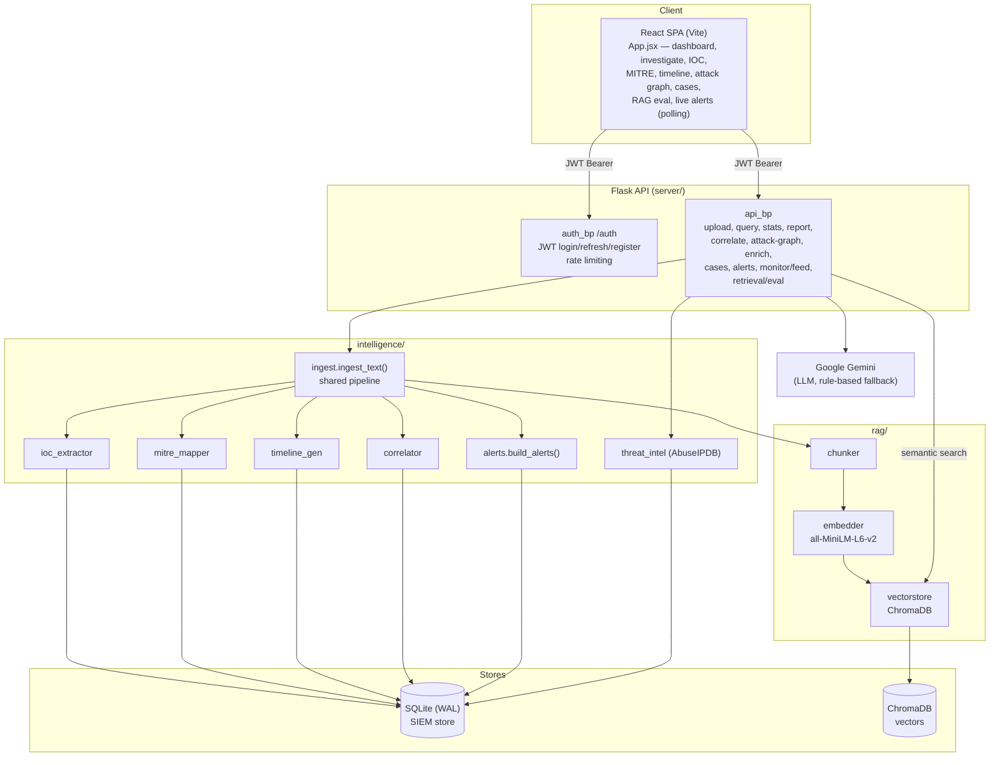

# SecureRAG — Architecture

## System overview



## Ingestion pipeline

Both `POST /upload` (file, deduped) and `POST /monitor/feed` (live, not deduped)
delegate to `ingest_text()` so behaviour is identical:

```
raw text
  -> chunk_text()                      (rag/chunker)
  -> embed_chunks()                    (rag/embedder, all-MiniLM-L6-v2)
  -> vector_store.store_embeddings()   (ChromaDB)  [written FIRST]
  -> SQLite transaction:
       store_log_chunk
       extract_iocs        -> store_ioc
       map_to_mitre        -> store_mitre_mapping
       generate_timeline   -> store_timeline_event
       store_file_upload
  -> correlate_iocs()      -> store_global_correlation
  -> build_alerts()        -> store_alert   (second transaction)
```

ChromaDB is written before SQLite so a vector-store failure leaves no orphaned
analysis rows. Gemini is **not** on the ingestion/alert path — alerts derive only
from timeline, MITRE, and correlation outputs.

## Query / retrieval paths

- `POST /query` — full investigation: embed → vector search → IOC + MITRE +
  timeline + correlation + Gemini analysis.
- `POST /retrieval/eval` — retrieval only: embed → vector search → ranked chunks
  with similarity, distance, source, and per-stage latency (no analysis), used by
  the RAG Eval dashboard.

## Persistence

| Store | Holds |
|---|---|
| **ChromaDB** | chunk embeddings for semantic retrieval (`securerag_logs` collection) |
| **SQLite (WAL)** | `log_chunks`, `extracted_iocs`, `chunk_ioc_mapping`, `chunk_mitre_mapping`, `timeline`, `global_correlations`, `file_uploads`, `users`, `cases`, `case_notes`, `ioc_enrichment`, `alerts` |

SQLite uses WAL with a busy/lock timeout (`SQLITE_TIMEOUT_SECONDS`, default 30s).
Writes that must be atomic share one connection via the `transaction()` context
manager (store methods accept `conn=` to enlist).

## Security model

- JWT access (15 min) + refresh (30 day); roles **ADMIN** / **ANALYST**.
- App fails closed without a strong `JWT_SECRET_KEY` (>=32 chars, no placeholders).
- Ingestion (`/upload`, `/monitor/feed`) is ADMIN-only; analysis endpoints allow
  ADMIN or ANALYST.
- Login rate limiting per client IP; generic 500s (no internal detail leaked).
- Secrets only in `server/.env` (gitignored).

## Deployment notes

The default runtime is the Flask/Werkzeug dev server (single process). For
production, run behind a WSGI server (waitress/gunicorn) and TLS, set
`CORS_ORIGINS` to the deployed frontend origin(s), and provide a strong
`JWT_SECRET_KEY` and rotated API keys via the environment.
