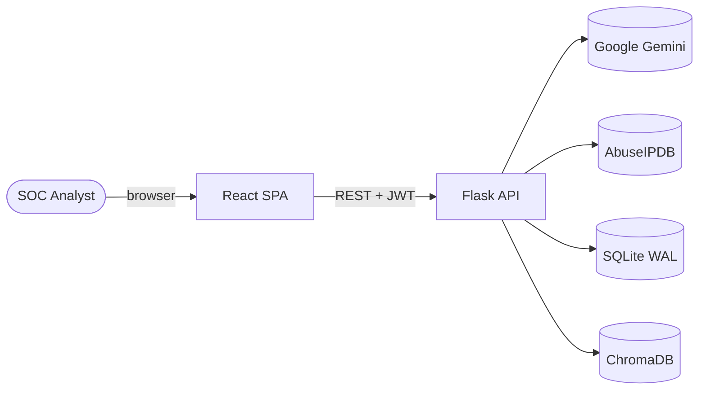
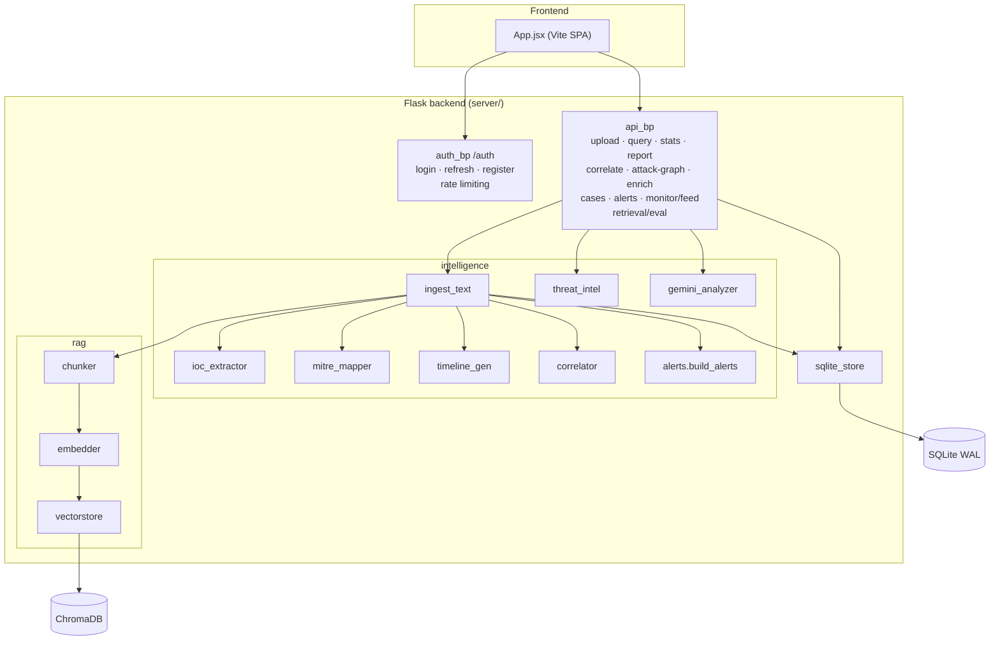
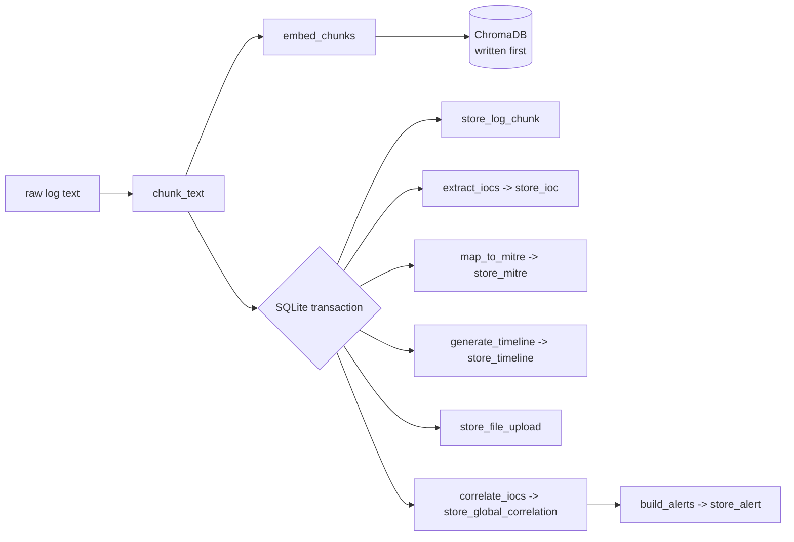
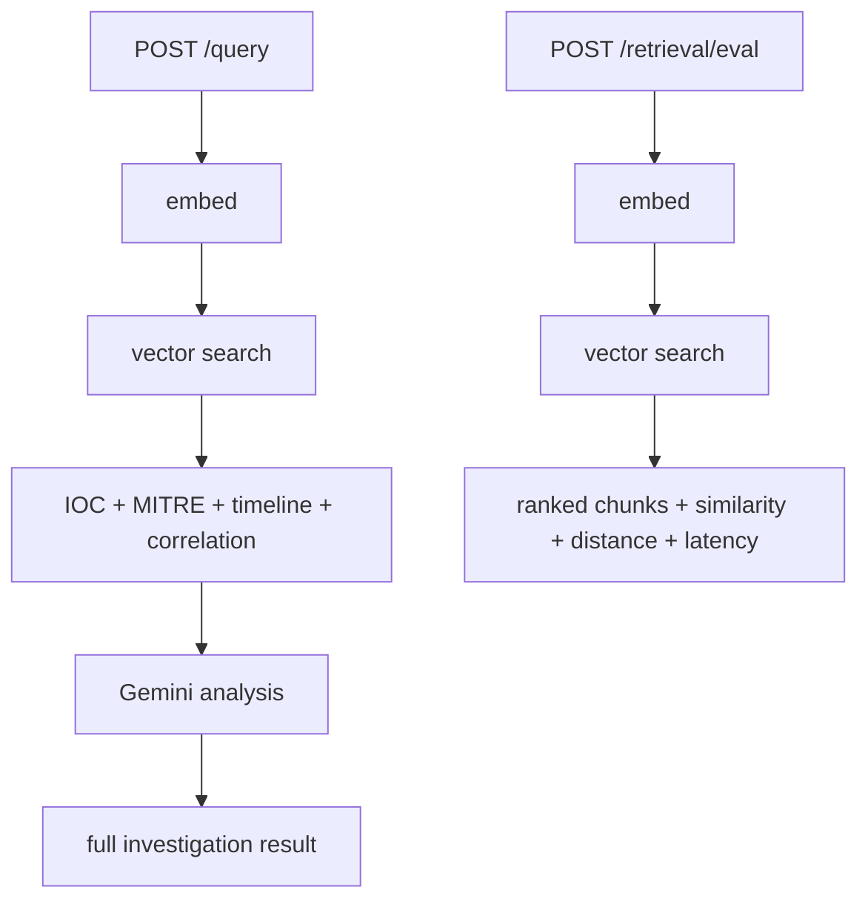
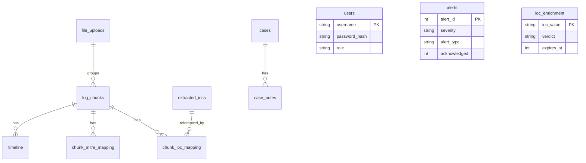
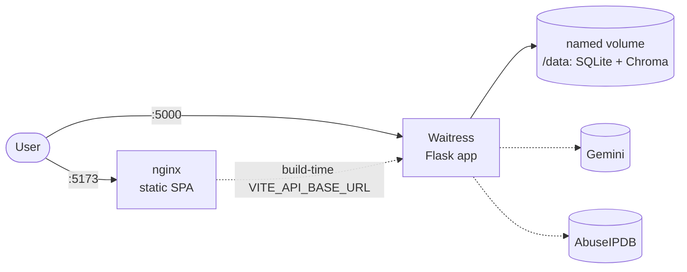
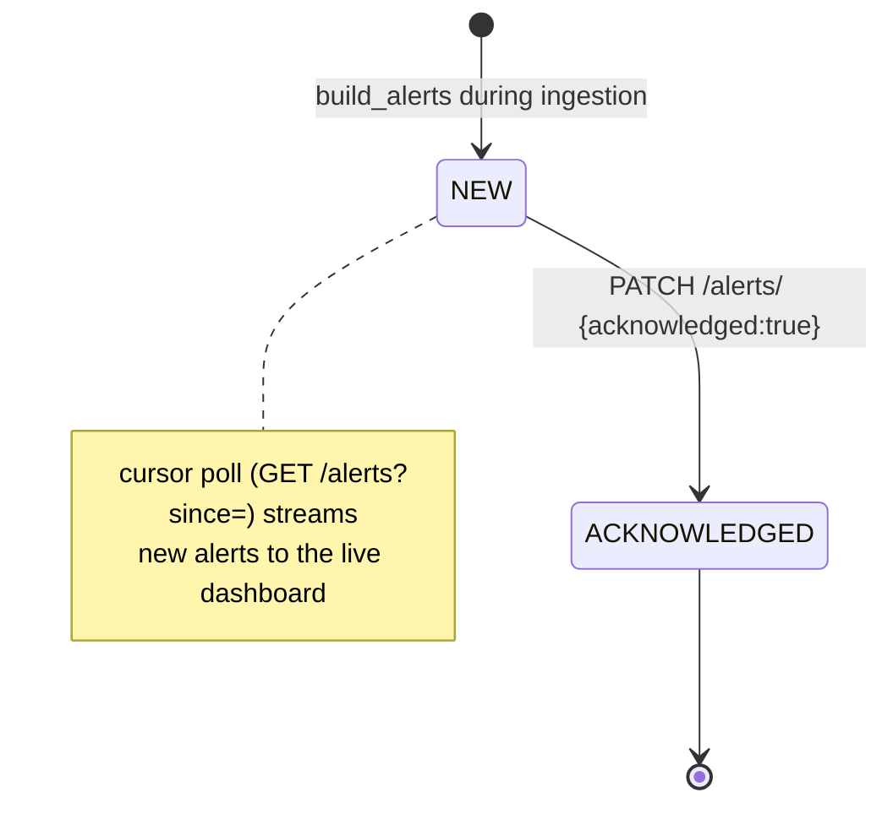
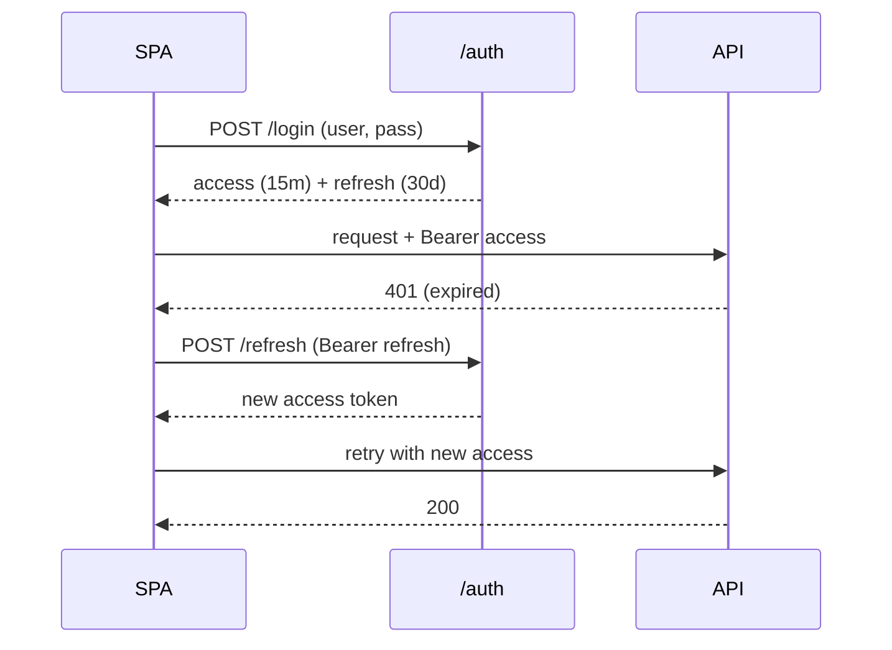

# SecureRAG — Architecture Diagram Set

Mermaid diagrams covering system context, components, data flow, the data model,
deployment, and key state machines. (GitHub renders Mermaid natively.)

---

## 1. System context

---

## 2. Component architecture

---

## 3. Ingestion data flow (shared by /upload and /monitor/feed)

ChromaDB is written before SQLite so a vector-store failure leaves no orphaned
analysis rows. Gemini is **not** on the ingestion/alert path.

---

## 4. Query vs. retrieval-eval paths

`/retrieval/eval` isolates the RAG step (no analysis/LLM) so latency and
similarity reflect retrieval only.

---

## 5. Data model (SQLite)

---

## 6. Deployment topology (Docker Compose)

---

## 7. Alert lifecycle

---

## 8. Authentication flow

